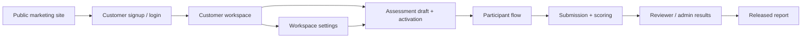

# Architecture Overview

This project is a multi-surface psychological assessment platform with two operational modes:

- SaaS workspace for companies and researchers
- future white-label adaptation on top of the same operational core and API

## Current deployment shape

### Frontend
- React + TypeScript + Vite
- source in `src/`
- deployed from the repository root to the main domain

### API
- Node.js + Express + TypeScript
- source in `apps/api`
- deployed separately on the API domain

### Database
- MySQL
- shared operational schema for:
  - admins and reviewers
  - customer workspaces
  - sessions and participants
  - submissions and results
  - question bank and scoring outputs

## High-level system map

## Main surfaces

### Public site
- landing page
- manual page
- white-label page
- signup and login entry points

### Customer workspace
- workspace overview
- create assessment flow
- assessment review / activation
- workspace settings

### Participant flow
- consent
- identity
- instructions
- test runner
- completion

### Internal admin and reviewer workspace
- dashboard
- participants
- test sessions
- question bank
- results
- reports
- settings

## Backend module structure

The API follows a modular Express structure:
- `auth`
- `site-auth`
- `site-onboarding`
- `site-workspace`
- `participants`
- `test-sessions`
- `question-bank`
- `public-sessions`
- `results`
- `reports`
- `settings`

Each module is expected to own its routes, service logic, and repository access.

## Data ownership model

### Admin side
- platform-level operations
- question bank and protected session control
- reviewer workflow and reporting

### Customer side
- owns a workspace account
- creates and manages customer assessments
- controls participant-facing defaults and workspace settings

### Participant side
- never uses admin or customer auth
- only uses signed session and submission access tokens

## Current multi-tenant boundary

The system is not yet a full enterprise tenant architecture, but it already has a customer workspace boundary through:
- `customer_accounts`
- `customer_assessments`
- customer-scoped onboarding APIs
- customer-scoped workspace settings

The next tenant evolution should formalize:
- role separation inside customer workspaces
- team members and invites
- branding and white-label boundaries
- plan and usage enforcement
- domain-based tenant resolution for shared white-label delivery

## Hosting topology

### Main domain
- Vite frontend build output
- public site and authenticated UI routes

### API domain
- Express app
- JSON APIs only

### Shared database
- MySQL used only by the API

## Documentation links

Use together with:
- `docs/new-flow.md`
- `docs/compliance.md`
- `docs/development-phases.md`
- `docs/auth-and-access.md`
- `docs/assessment-engine.md`

## White-label principle

White-label should run on the same API and assessment engine as the SaaS product. The recommended default is a shared multi-tenant platform with host-based workspace resolution, not a forked application.
