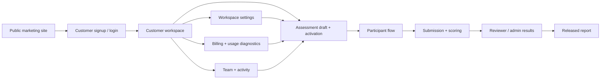

# Architecture Overview

This project is a multi-surface psychological assessment platform with two operational modes:

- SaaS workspace for companies and researchers
- Future white-label adaptation on top of the same operational core and API

## Technology Stack

### Frontend
- **Framework**: React 19 + TypeScript + Vite
- **Styling**: TailwindCSS + Radix UI primitives
- **Routing**: React Router v7
- **Source**: `src/` directory
- **Deployment**: Cloudflare Pages
- **Build**: Vite static site generation

### API
- **Runtime**: Cloudflare Workers (edge)
- **Framework**: Hono + TypeScript
- **Validation**: Zod
- **Source**: `workers/` directory
- **Deployment**: `wrangler deploy`
- **Routes**: `workers/src/routes/*.ts`

### Database
- **Engine**: Cloudflare D1 (SQLite-compatible)
- **Migrations**: `workers/migrations/*.sql`
- **Access**: D1Database binding via `env.DB`
- **Schema**: Single shared schema for all surfaces

## High-level system map



## Main surfaces

### Public site
- `/` - Landing page
- `/manual` - User manual
- `/white-label` - White-label information page
- `/signup` - Customer registration
- `/login` - Customer login
- `/admin/login` - Admin login

### Customer workspace (`/workspace/*`)
- Workspace overview dashboard
- Company settings
- Billing and usage diagnostics
- Team management
- Activity feed
- Results list and detail
- Create assessment flow
- Assessment review/activation
- Participant delivery operations
- Workspace settings

### Participant flow (`/t/:token/*`)
- Consent page
- Identity collection
- Instructions
- Test runner
- Completion screen

### Admin workspace (`/admin/*`)
- Dashboard with metrics
- Participants management
- Test sessions management
- Question bank CRUD
- Results list and review
- Reviewer queue
- Reports summary
- Settings (profile, session defaults)
- Customers management

## Backend module structure

The API follows a modular Hono structure in `workers/src/routes/`:

| Module | Routes Prefix | Purpose |
|--------|---------------|---------|
| `auth.ts` | `/api/auth/*` | Admin authentication |
| `site-auth.ts` | `/api/site-auth/*` | Customer authentication, invites, password reset |
| `site-workspace.ts` | `/api/site-workspace/*` | Workspace settings, team, activity |
| `site-billing.ts` | `/api/site-billing/*` | Subscription, checkout, invoices |
| `site-results.ts` | `/api/site-results/*` | Customer result viewing, CSV export |
| `site-onboarding.ts` | `/api/site-onboarding/*` | Assessment CRUD, participants, invites |
| `dashboard.ts` | `/api/dashboard/*` | Admin dashboard metrics |
| `test-sessions.ts` | `/api/test-sessions/*` | Admin session management |
| `participants.ts` | `/api/participants/*` | Admin participant list |
| `question-bank.ts` | `/api/question-bank/*` | Admin question management |
| `results.ts` | `/api/results/*` | Admin results, review queue, reviewers |
| `reports.ts` | `/api/reports/*` | Admin reports summary |
| `settings.ts` | `/api/settings/*` | Admin profile and platform settings |
| `customers.ts` | `/api/customers/*` | Admin customer management |
| `public-sessions.ts` | `/api/public/*` | Participant test delivery |
| `health.ts` | `/api/health` | Health check endpoint |

Each module owns its routes, validation schemas, and database access.

## Data ownership model

### Admin side
- Platform-level operations
- Question bank and protected session control
- Reviewer workflow and reporting
- Customer management

### Customer side
- Owns a workspace account
- Creates and manages customer assessments
- Controls participant-facing defaults and workspace settings
- Manages subscription state, capacity, teammates, and customer-safe result access

### Participant side
- Never uses admin or customer auth
- Only uses signed session and submission access tokens
- Accesses public endpoints only

## Database schema overview

### Core tables
- `admins` - Admin accounts and roles
- `customer_accounts` - Customer workspace owners
- `customer_workspace_members` - Team members
- `test_sessions` - Assessment configurations
- `participants` - Test participants
- `submissions` - Test attempts
- `results` - Scored results

### SaaS billing tables
- `workspace_subscriptions` - Plan and billing state
- `billing_checkout_sessions` - Checkout tracking
- `billing_invoices` - Invoice history
- `workspace_usage_events` - Usage audit
- `workspace_usage_snapshots` - Current usage

### Customer workspace tables
- `customer_assessments` - Customer-owned sessions
- `customer_assessment_participants` - Participant lists

### System tables
- `audit_events` - Action logging
- `question_bank` - Question storage
- `password_resets` - Password reset tokens
- `app_settings` - Platform configuration

## Current SaaS boundary

The current SaaS model is separated by customer workspace through:

- `customer_accounts`
- `workspace_subscriptions`
- `customer_assessments`
- `customer_workspace_members`
- Customer-scoped onboarding, billing, workspace, and result APIs

Operationally, the customer workspace enforces:

- Assessment creation counts against plan capacity
- Participant imports and additions count against participant capacity
- Owner and member seats count against team-seat capacity
- Customer pages receive usage diagnostics and upgrade guidance from the API

## Hosting topology

### Production
```
Frontend: Cloudflare Pages
├── Served from repository root
├── Build: vite build
└── Routes: React Router v7

API: Cloudflare Workers
├── Deployed via: wrangler deploy
├── Routes mounted at: /api/*
└── Edge runtime globally

Database: Cloudflare D1
├── Binding: env.DB
├── Migrations: workers/migrations/*.sql
└── Remote commands: wrangler d1 execute psikotest-db --remote
```

### Local Development
```bash
# Frontend
npm run dev          # Vite dev server at localhost:5173

# API
cd workers && npm run dev   # Wrangler dev at localhost:8787
```

## Documentation links

Use together with:
- `docs/new-flow.md` - Assessment flow details
- `docs/compliance.md` - Compliance requirements
- `docs/project-status.md` - Current status and backlog
- `docs/api-endpoints.md` - Full API documentation
- `docs/auth-and-access.md` - Authentication architecture
- `docs/assessment-engine.md` - Scoring and delivery
- `docs/billing-operations.md` - Billing maintenance
- `docs/commit-log.md` - Change history

## White-label principle

White-label should run on the same API and assessment engine as the SaaS product. The recommended default is a shared multi-tenant platform with host-based workspace resolution, not a forked application.

## Billing Foundation

The SaaS platform treats billing as a workspace-level subsystem.

Core persistence includes:
- `workspace_subscriptions` - Plan state
- `billing_checkout_sessions` - Checkout tracking
- `billing_invoices` - Invoice history
- `billing_webhook_events` - Provider webhooks
- `workspace_usage_events` - Usage tracking
- `workspace_usage_snapshots` - Current usage counts

This keeps the current dummy checkout compatible with later provider-backed billing without redesigning the workspace contract.