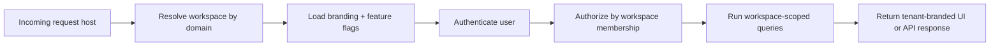

# White-label Architecture

## Core Principle

White-label should use the same application core and the same API platform as the SaaS product.

This means:
- the public SaaS site remains the main acquisition and self-serve surface
- white-label tenants still run on the same assessment engine, reporting engine, and API contracts
- the main change is tenant identity, branding, domain routing, and workspace isolation

The white-label product is not a separate MVP. It is a tenant-aware operating mode on top of the same platform.

## Short Answer

Yes: white-label should still use the same API.

Recommended default model:
- one frontend codebase
- one API codebase
- one shared MySQL database
- tenant resolution by host or domain

Use dedicated infrastructure only for high-value enterprise or compliance-heavy clients.

## Recommended Deployment Modes

### 1. Shared SaaS mode
- domain: `psikotest.vanaila.com`
- audience: self-serve customers
- branding: Vanaila
- database: shared

### 2. Shared white-label mode
- domain: `client.psikotest.vanaila.com` or custom domain
- audience: organizations, consultancies, research labs
- branding: tenant-specific
- database: shared

### 3. Dedicated enterprise white-label mode
- domain: custom domain only
- audience: enterprise / regulated clients
- branding: tenant-specific
- database: dedicated per client if required
- deployment: optional dedicated app instance

## Current Schema Position

The current SaaS schema in [001_init_schema.sql](../apps/api/src/database/migrations/001_init_schema.sql) already contains a partial tenant boundary:
- `customer_accounts`
- `customer_assessments`
- `customer_workspace_members`
- workspace settings stored in `settings_json`

This is enough for SaaS onboarding and workspace operations, but it is not the final long-term white-label model because `customer_accounts` currently mixes:
- the user identity
- the workspace / organization identity
- workspace settings

That is acceptable for MVP SaaS, but long-term white-label should separate identity from tenant ownership.

## Long-term Schema Direction

### Identity and tenant layer

#### `workspace_users`
Stores login identities.

Suggested columns:
- `id`
- `full_name`
- `email`
- `password_hash`
- `status`
- `last_login_at`
- `session_version`
- `created_at`
- `updated_at`

#### `workspaces`
Stores the tenant / company / research lab record.

Suggested columns:
- `id`
- `name`
- `slug`
- `workspace_type` (`business`, `researcher`, `consultancy`, later more if needed)
- `status`
- `owner_user_id`
- `created_at`
- `updated_at`

#### `workspace_members`
Maps users to workspaces and roles.

Suggested columns:
- `id`
- `workspace_id`
- `user_id`
- `role` (`owner`, `admin`, `operator`, `reviewer`)
- `member_status` (`active`, `invited`, `suspended`)
- `invited_at`
- `last_notified_at`
- `created_at`
- `updated_at`

### White-label tenant configuration

#### `workspace_domains`
Maps incoming hosts to a workspace.

Suggested columns:
- `id`
- `workspace_id`
- `domain`
- `is_primary`
- `domain_type` (`subdomain`, `custom_domain`)
- `ssl_status`
- `verification_status`
- `created_at`
- `updated_at`

#### `workspace_branding`
Stores brand identity for the tenant portal.

Suggested columns:
- `id`
- `workspace_id`
- `brand_name`
- `brand_tagline`
- `logo_url`
- `favicon_url`
- `primary_color`
- `accent_color`
- `font_family`
- `footer_text`
- `support_email`
- `contact_person`
- `created_at`
- `updated_at`

#### `workspace_features`
Stores which modules the tenant can use.

Suggested columns:
- `id`
- `workspace_id`
- `iq_enabled`
- `disc_enabled`
- `workload_enabled`
- `custom_enabled`
- `reviewer_workflow_enabled`
- `white_label_enabled`
- `custom_domain_enabled`
- `created_at`
- `updated_at`

#### `workspace_subscriptions`
Stores plan and limit information.

Suggested columns:
- `id`
- `workspace_id`
- `plan_code`
- `status`
- `billing_cycle`
- `participant_limit`
- `assessment_limit`
- `team_member_limit`
- `trial_ends_at`
- `renews_at`
- `created_at`
- `updated_at`

### Operational tenant ownership

Every tenant-owned operational record should be scoped by `workspace_id`.

This applies to:
- `test_sessions`
- `participants`
- `customer_assessments` or future `workspace_assessments`
- `submissions`
- `results`
- customer-level question banks or templates

Even when joins can infer ownership indirectly, explicit `workspace_id` is recommended for:
- safer authorization checks
- easier reporting queries
- faster filtering and indexing
- future archival and export per workspace

## Recommended Operational Data Model

### Keep global
These can remain global platform tables:
- `admins`
- `test_types`
- system question library if it is platform-owned
- global templates if you introduce them later

### Make workspace-scoped
These should be explicitly tenant-owned:
- tenant-created sessions
- tenant participants
- customer assessments
- submissions
- results
- workspace-specific custom question banks
- workspace-specific report templates

## Request Routing Model

## Migration Path From Current SaaS Schema

### Phase A: practical white-label on top of current SaaS
Keep the current SaaS model and add only what is necessary:
- workspace slug
- custom domain mapping
- branding JSON or branding table
- feature flags
- subscription / plan state

This gets white-label live faster.

### Phase B: normalize the tenant model
Split `customer_accounts` into:
- `workspace_users`
- `workspaces`
- `workspace_members`

Move branding and billing into dedicated workspace tables.

### Phase C: move operational ownership to explicit workspace keys
Add `workspace_id` to tenant-owned operational tables and migrate authorization rules to use it directly.

## Practical Recommendation For This Product

Do not fork the app.

Build the white-label product as:
- one codebase
- one shared API
- one shared DB by default
- custom domain and branding on top
- dedicated deployment only when a client pays for enterprise isolation

That gives you:
- lower maintenance
- faster feature delivery
- one assessment engine to secure and improve
- one reporting model
- one reviewer workflow

## Immediate Future Work

If white-label becomes an active delivery stream, the next engineering tasks should be:
1. add workspace/domain resolution
2. introduce workspace branding storage
3. add plan and feature gating at workspace level
4. move toward `workspace_users` + `workspaces` normalization
5. make all customer-facing operational queries explicitly workspace-scoped
